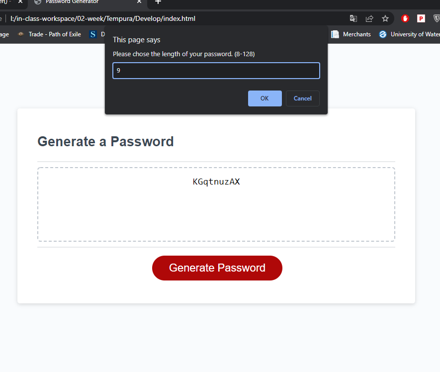
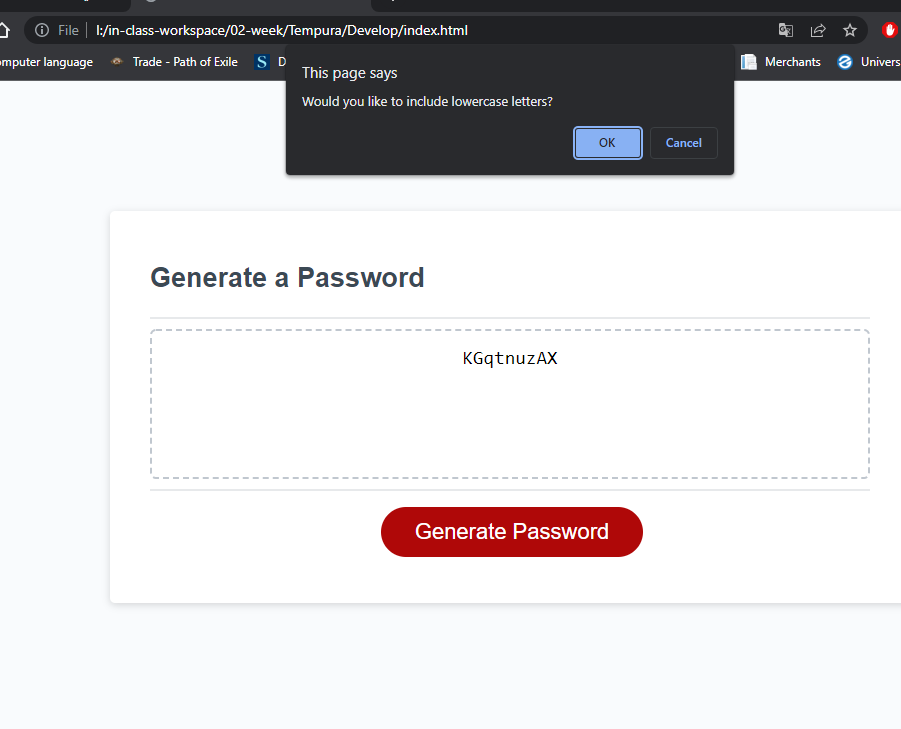
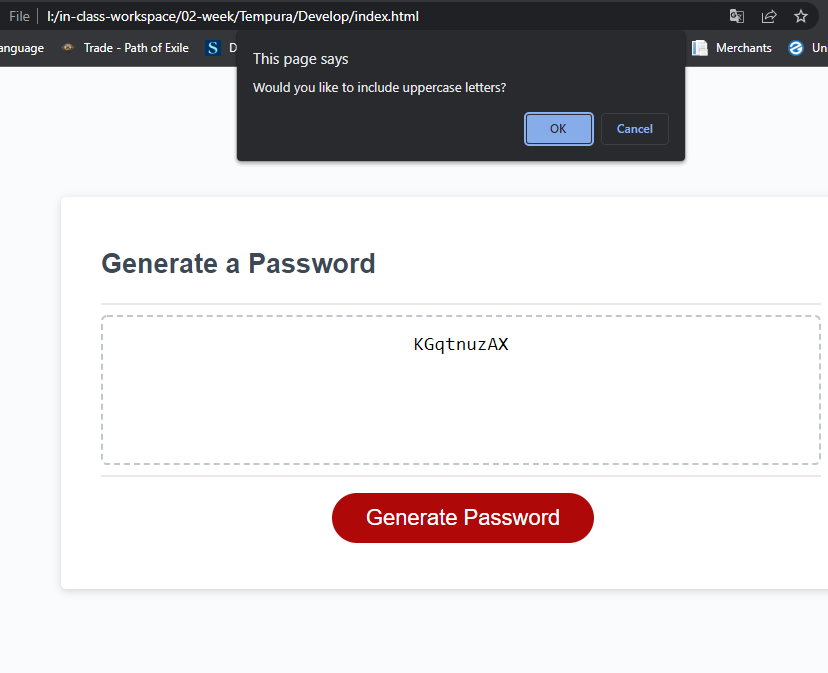
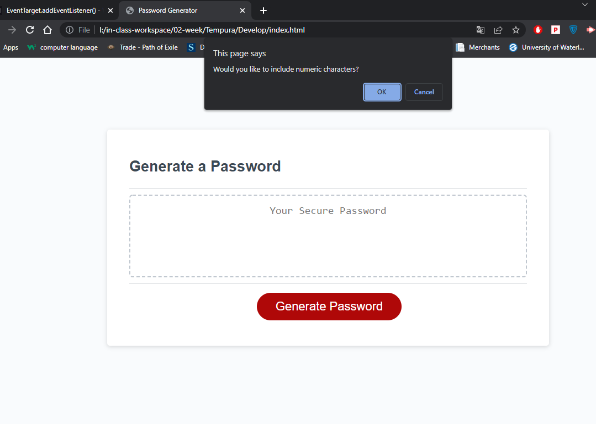
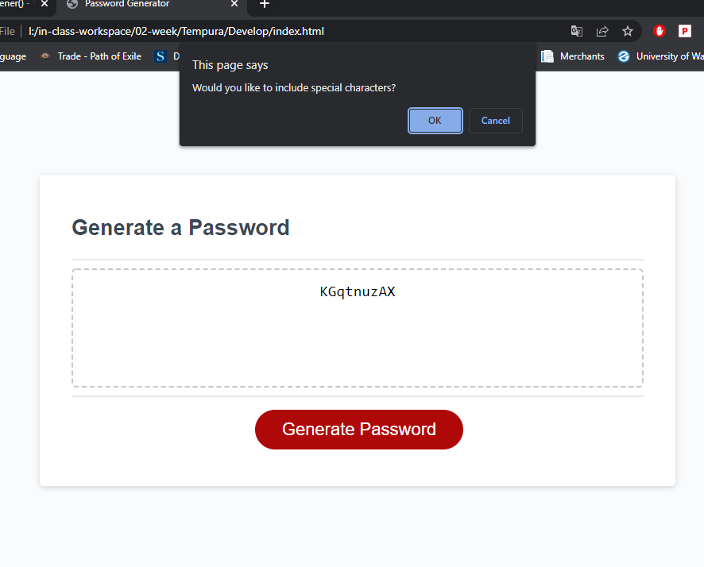
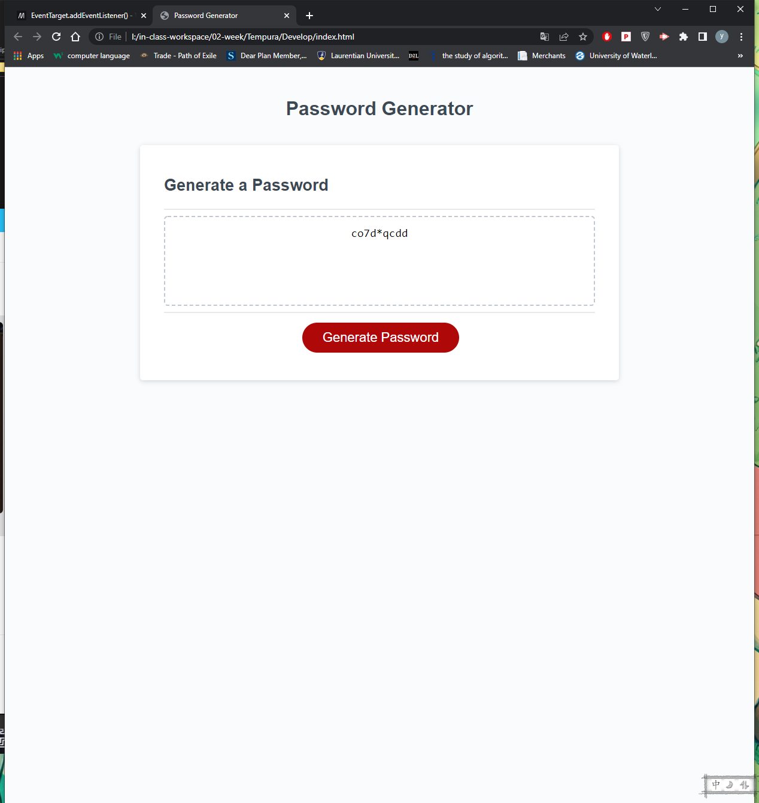

# 03 JavaScript: Password Generator

## Description
The main part for this challenge is how to write a function to generate password according to user input.
I disassmble the main question into pieces. I try to solve them one by one, alfer all is resolved. I assmble all of them as one whole piece.
According to the acceptance criteria, I need to get user input about the length of password and charater type. So the first step is to get user input.
I use window.prompt for character length and window.confirm for character type.
After that, I need to verify user input. I wrote 2 functions to verify user input. characterTypeVerify is used to make sure user chose at least one character type for password. passwordLengthVerify is used to confirm the number entered by the user is between 8 and 128, not null, and a number.

Ps:
I was trying to use window.prompt for charactertype input, but I found that it is hard to verify user input.(I used more than 1 hour to write characterTypeVerify function with window.prompt. :(  )

Similary idea, I use getRandomCharacter function to get randow charater according to the character type user has chosen. And use for statement to assmble password.

Finally the password will be showed in the textarea.

https://midnightwxd.github.io/Tempura/